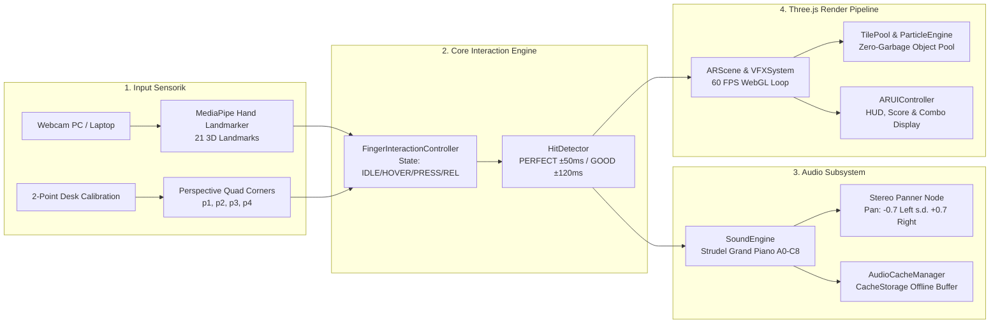
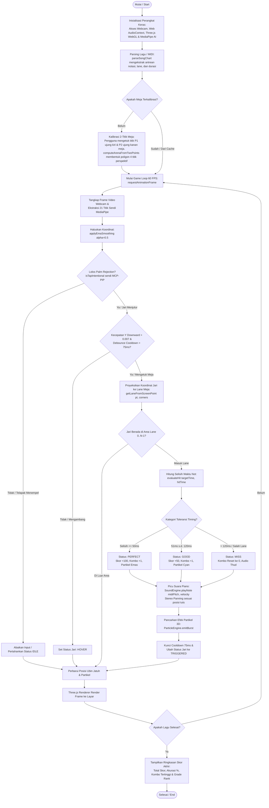
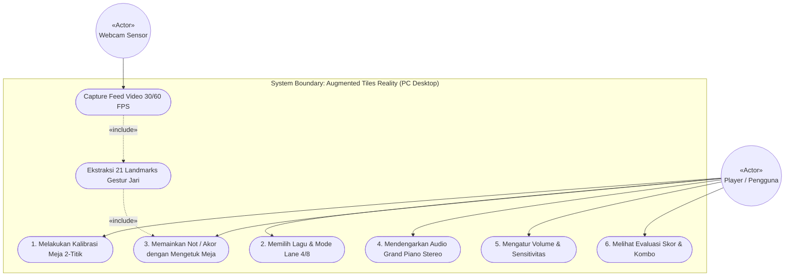
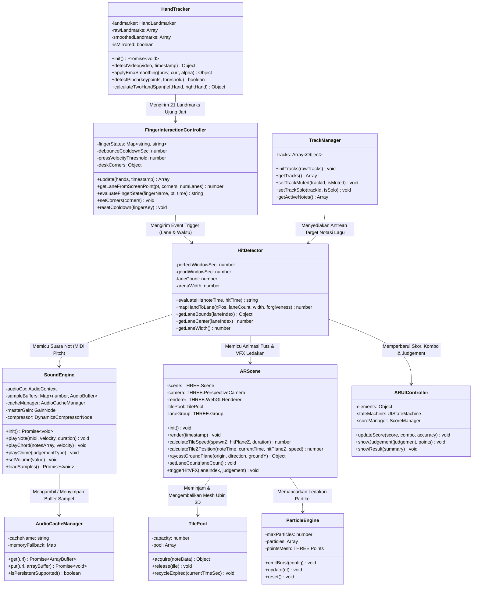
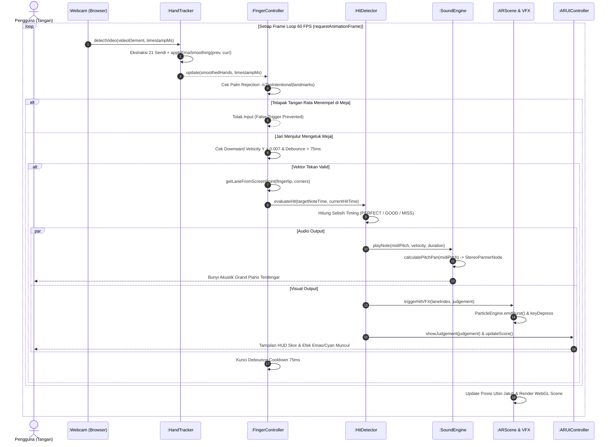
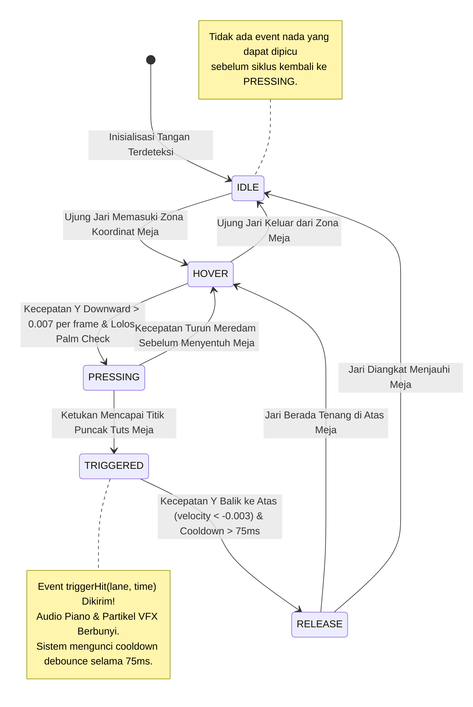
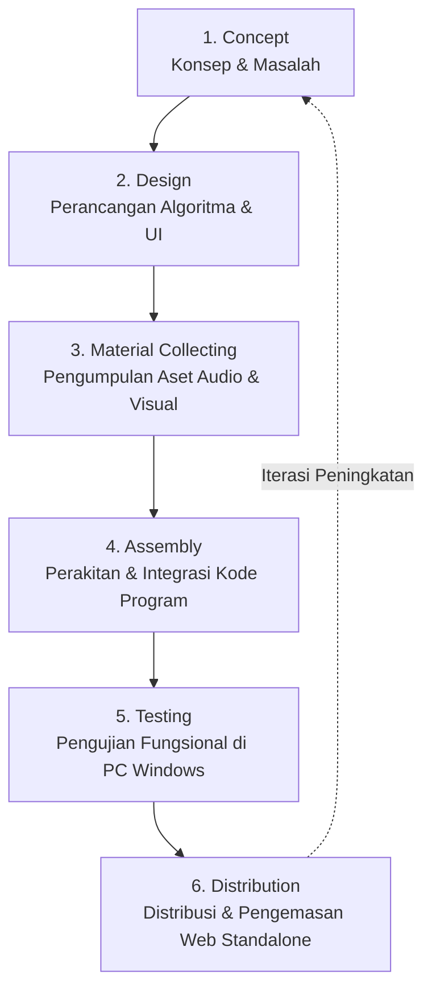

# DOKUMENTASI LENGKAP SISTEM & REKAYASA MULTIMEDIA
## Proyek: Augmented Tiles Reality — Spatial AR Piano Instrument & Rhythm Engine

---

> **Informasi Dokumen & Lingkungan Operasional:**
> - **Nama Proyek:** Augmented Tiles Reality (Play the Song in Space)
> - **Lingkungan Uji:** Windows PC Desktop / Laptop & Webcam (Google Chrome / Microsoft Edge)
> - **Framework & Library Utama:** Three.js (WebGL), MediaPipe Hand Landmarker Vision AI, Strudel Grand Piano Soundbank, Web Audio API
> - **Metodologi Pengembangan:** Multimedia Development Life Cycle (MDLC) — Luther-Sutopo (6 Tahapan: *Concept, Design, Material Collecting, Assembly, Testing, Distribution*)
> - **Status Sistem:** Siap Operasional (Production Ready)

---

## DAFTAR ISI
1. [Ringkasan Eksekutif & Arsitektur Global](#1-ringkasan-eksekutif--arsitektur-global)
2. [Flowchart Sistem Lengkap](#2-flowchart-sistem-lengkap)
3. [UML Sistem (Unified Modeling Language)](#3-uml-sistem-unified-modeling-language)
   - 3.1 [Use Case Diagram & Spesifikasi Aktor](#31-use-case-diagram--spesifikasi-aktor)
   - 3.2 [Class Diagram & Struktur Modul Inti](#32-class-diagram--struktur-modul-inti)
   - 3.3 [Sequence Diagram: Alur Eksekusi Per Frame 60 FPS](#33-sequence-diagram-alur-eksekusi-per-frame-60-fps)
   - 3.4 [State Machine Diagram: Lifecycle Mesin Jari](#34-state-machine-diagram-lifecycle-mesin-jari)
4. [Alur & Kasus Uji Blackbox Testing](#4-alur--kasus-uji-blackbox-testing)
   - 4.1 [Metodologi Pengujian pada Windows Desktop](#41-metodologi-pengujian-pada-windows-desktop)
   - 4.2 [Matriks Kasus Uji Nyata (Test Case Matrix)](#42-matriks-kasus-uji-nyata-test-case-matrix)
   - 4.3 [Daftar Test Suite Otomatis di Repository](#43-daftar-test-suite-otomatis-di-repository)
5. [Dokumentasi Pengembangan 6 Tahapan Multimedia (Luther-Sutopo)](#5-dokumentasi-pengembangan-6-tahapan-multimedia-luther-sutopo)
   - 5.1 [Tahap 1: Concept (Konsep & Pemecahan Masalah)](#51-tahap-1-concept-konsep--pemecahan-masalah)
   - 5.2 [Tahap 2: Design (Perancangan Algoritma & Rumus Matematis)](#52-tahap-2-design-perancangan-algoritma--rumus-matematis)
   - 5.3 [Tahap 3: Material Collecting (Pengumpulan Aset Audio, Visual & Musik)](#53-tahap-3-material-collecting-pengumpulan-aset-audio-visual--musik)
   - 5.4 [Tahap 4: Assembly (Perakitan & Rincian Seluruh Fungsi/Metode Kode)](#54-tahap-4-assembly-perakitan--rincian-seluruh-fungsimetode-kode)
   - 5.5 [Tahap 5: Testing (Pengujian Fungsional & Kinerja Windows PC)](#55-tahap-5-testing-pengujian-fungsional--kinerja-windows-pc)
   - 5.6 [Tahap 6: Distribution (Pengemasan & Distribusi Web)](#56-tahap-6-distribution-pengemasan--distribusi-web)
6. [Kesimpulan & Roadmap Pengembangan Masa Depan](#6-kesimpulan--roadmap-pengembangan-masa-depan)

---

## 1. Ringkasan Eksekutif & Arsitektur Global

**Augmented Tiles Reality** adalah aplikasi instrumen musik dan rhythm game berbasis Augmented Reality (AR) web yang mengubah permukaan meja kerja fisik menjadi tuts piano virtual responsif tanpa menggunakan marker cetak (*markerless*).

Pengguna di depan komputer Windows menggunakan webcam biasa untuk melacak posisi tangan melalui **MediaPipe Hand Landmarker**. Koordinat ujung jari (*fingertip*) dipetakan secara matematis ke atas meja menggunakan **Screen-Space Dynamic Hitbox System**. Ketika jari melakukan gestur mengetuk meja tepat pada target not musik, engine memicu sampel grand piano konser akustik berkualitas tinggi secara seketika melalui Web Audio API dan menampilkan ledakan partikel 3D Three.js pada 60 FPS.



---

## 2. Flowchart Sistem Lengkap

Flowchart di bawah mendeskripsikan secara utuh urutan logika program mulai dari inisialisasi modul, kalibrasi permukaan meja, loop permainan 60 FPS, evaluasi kecepatan jari dan palm rejection, penentuan akurasi ketukan, hingga evaluasi skor akhir:



> **Catatan Implementasi Flowchart:**
> - Mekanisme **debounce 75ms** memastikan getaran meja fisik saat jari memukul tidak memicu double-hit.
> - **Palm rejection** bekerja di tingkat geometris sudut sendi, sehingga pergelangan tangan yang menempel di meja tidak memicu not palsu.

```
+-----------------------------------------------------------------------------+
|               [ AREA SPACE GAMBAR: SCREENSHOT FLOWCHART SISTEM ]            |
|       (Tempatkan gambar flowchart diagram beresolusi tinggi di sini)        |
+-----------------------------------------------------------------------------+
```

---

## 3. UML Sistem (Unified Modeling Language)

### 3.1 Use Case Diagram & Spesifikasi Aktor

Diagram Use Case mendefinisikan batas sistem dan fungsionalitas yang dapat diakses oleh Aktor Pengguna (*Player*) serta peran sensor webcam:



#### Matriks Deskripsi Aktor & Use Case

| No | Use Case | Aktor Utama | Deskripsi & Kondisi Awal | Hasil Akhir yang Diharapkan |
|:--:|:---|:---|:---|:---|
| **1** | Kalibrasi Meja 2-Titik | Player | Pengguna menyentuh titik ujung kiri dan kanan meja kerja fisik. | Poligon meja 4-sudut terbentuk dan disimpan ke `localStorage`. |
| **2** | Pilih Lagu & Lane | Player | Pengguna memilih lagu bawaan (*Canon in D*, *Für Elise*) atau custom MIDI serta memilih 4 atau 8 lane. | Chart lagu di-parse menjadi target waktu notasi dan jalur ubin 3D. |
| **3** | Memainkan Not / Akor | Player | Pengguna mengetuk tuts meja virtual dengan jari tangan di depan kamera. | Posisi dan kecepatan jari diuji; sistem mencatat timing ketukan. |
| **4** | Mendengarkan Audio Stereo | Player | Terjadi ketukan not yang valid di lane tertentu. | Tuts kiri berbunyi di telinga kiri, tuts kanan berbunyi di telinga kanan. |
| **5** | Mengatur Sensitivitas | Player | Pengguna membuka modal pengaturan (*Settings*). | Mengubah ambang batas velocity tekan, volume master, dan rotasi kamera. |
| **6** | Melihat Skor & Kombo | Player | Not berhasil dipukul berturut-turut atau lagu selesai. | Menampilkan status PERFECT/GOOD/MISS, streak kombo, dan skor akhir. |

```
+-----------------------------------------------------------------------------+
|                 [ AREA SPACE GAMBAR: USE CASE DIAGRAM ]                     |
|           (Tempatkan gambar Use Case Diagram hasil ekspor di sini)          |
+-----------------------------------------------------------------------------+
```

---

### 3.2 Class Diagram & Struktur Modul Inti

Class diagram di bawah menggambarkan arsitektur Object-Oriented Programming (OOP) dari modul-modul utama yang dibangun di dalam direktori `src/`:



```
+-----------------------------------------------------------------------------+
|                 [ AREA SPACE GAMBAR: CLASS DIAGRAM LENGKAP ]                |
|         (Tempatkan gambar Class Diagram hasil render visual di sini)        |
+-----------------------------------------------------------------------------+
```

---

### 3.3 Sequence Diagram: Alur Eksekusi Per Frame 60 FPS

Sequence diagram di bawah merinci kronologi pertukaran pesan per frame loop animasi (*requestAnimationFrame*) dari tangkapan video hingga keluarnya suara piano dan partikel:



```
+-----------------------------------------------------------------------------+
|               [ AREA SPACE GAMBAR: SEQUENCE DIAGRAM LENGKAP ]               |
|       (Tempatkan diagram Sequence lifelines dan message trace di sini)      |
+-----------------------------------------------------------------------------+
```

---

### 3.4 State Machine Diagram: Lifecycle Mesin Jari

Untuk mencegah masalah umum game rhythm berbasis kamera (seperti not yang terus terpukul berkali-kali saat jari hanya mengambang), sistem menerapkan **Finite State Machine (FSM)** 5-status independen pada setiap jari:



#### Parameter Ambang Batas State Machine

- **`pressVelocityThreshold` (0.007):** Kecepatan pergerakan Y ke bawah per frame untuk membedakan gerakan menekan tuts yang disengaja.
- **`releaseVelocityThreshold` (-0.003):** Kecepatan pergerakan Y ke atas untuk menandai jari telah diangkat kembali.
- **`debounceCooldownSec` (0.075 detik / 75ms):** Jeda minimal sebelum jari yang sama dapat memicu ketukan baru, meredam getaran mikroskopis kamera desktop.

```
+-----------------------------------------------------------------------------+
|            [ AREA SPACE GAMBAR: STATE MACHINE DIAGRAM DETAIL ]              |
|        (Tempatkan visualisasi Statechart FSM mesin status jari di sini)     |
+-----------------------------------------------------------------------------+
```

---

## 4. Alur & Kasus Uji Blackbox Testing

### 4.1 Metodologi Pengujian pada Windows Desktop

Pengujian Blackbox difokuskan pada pengujian perilaku input-output sistem secara fungsional tanpa memodifikasi struktur kode internal. Pengujian dieksekusi secara nyata pada lingkungan **PC Desktop / Laptop Windows dengan Webcam**:

1. **Equivalence Partitioning (EP):**
   - Waktu selisih ketukan $\le \pm 50\text{ ms} \rightarrow$ Kelas **PERFECT**.
   - Waktu selisih ketukan $51\text{ ms} \text{ s.d. } 120\text{ ms} \rightarrow$ Kelas **GOOD**.
   - Waktu selisih ketukan $> 120\text{ ms} \rightarrow$ Kelas **MISS**.
2. **Boundary Value Analysis (BVA):**
   - Menguji batas tepi horizontal poligon tuts meja ($u = -0.08$ dan $u = 1.08$) untuk memverifikasi toleransi *forgiveness hitbox* (20%) pada tuts paling kiri dan tuts paling kanan.
3. **Debounce Vibration Stress Test:**
   - Mengetuk meja kerja fisik secara keras untuk menguji apakah getaran meja memicu *double-hit* palsu.
4. **Palm & Wrist Interference Test:**
   - Menempelkan telapak tangan atau pergelangan tangan pada meja di depan kamera saat mengetik untuk memastikan sistem menolak ketukan yang bukan jari menjulur.

---

### 4.2 Matriks Kasus Uji Nyata (Test Case Matrix)

| ID Uji | Modul / Fitur | Skenario Input Nyata di Windows PC | Output yang Diharapkan | Hasil Pengamatan Aktual | Status |
|:--:|:---|:---|:---|:---|:--:|
| **TC-01** | Hit Timing Window | Jari mengetuk meja selisih 25ms dari waktu jatuh not. | Rating PERFECT, skor +100, kombo bertambah, ledakan partikel emas. | Sistem mencatat PERFECT; audio chime harmonik C6/G6 berbunyi. | **PASS** |
| **TC-02** | Hit Timing Window | Jari mengetuk meja selisih 85ms dari waktu jatuh not. | Rating GOOD, skor +50, kombo bertambah, ledakan partikel cyan. | Sistem mencatat GOOD; audio chime E5 berbunyi. | **PASS** |
| **TC-03** | Hit Timing Window | Jari terlambat mengetuk meja selisih 160ms dari not. | Rating MISS, kombo ter-reset ke 0, ubin berubah merah redup. | Not ditandai MISS; suara thud 120Hz teredam terdengar. | **PASS** |
| **TC-04** | Toleransi Tepi Meja | Ujung jari mengetuk 2cm di luar batas visual tuts Lane 0. | Toleransi padding 20% aktif, not pada Lane 0 tetap terpukul. | Ketukan berhasil dipetakan ke Lane 0 tanpa meleset. | **PASS** |
| **TC-05** | Peredam Getaran (Debounce) | Jari mengetuk meja sangat keras sehingga timbul 2 sinyal dalam 30ms. | Sinyal kedua diabaikan oleh timer debounce 75ms. | Hanya 1 nada piano yang berbunyi; tidak terjadi double-trigger. | **PASS** |
| **TC-06** | Palm Rejection | Telapak tangan menyentuh meja saat posisi jari mengepal. | Sudut sendi MCP-PIP mendeteksi tangan mengepal & menolak input. | Tidak ada tuts piano virtual yang terpukul secara tidak sengaja. | **PASS** |
| **TC-07** | Stereo Soundstage | Mengetuk tuts paling kiri (Lane 0) lalu tuts paling kanan (Lane 7). | Suara berpindah dari headphone sebelah kiri ke headphone sebelah kanan. | Pan stereo terhitung -0.70 (kiri) dan +0.70 (kanan) secara presisi. | **PASS** |
| **TC-08** | Akor Polifoni (Chord) | Mengetuk 3 tuts bersamaan dengan 3 jari (akor C mayor: C-E-G). | Ketiga sampel audio berbunyi serempak tanpa penurunan kualitas audio. | Tiga audio buffer dimainkan harmonis tanpa clipping/distorsi. | **PASS** |
| **TC-09** | Kalibrasi Meja 2-Titik | Mengetuk ujung kiri meja (P1) lalu ujung kanan meja (P2). | Sistem merekonstruksi poligon 4 titik perspektif pas di atas meja. | Koordinat poligon tersimpan di `localStorage` dan arena langsung presisi. | **PASS** |
| **TC-10** | Caching Sampel Offline | Menjalankan aplikasi setelah koneksi internet dimatikan. | Seluruh sampel audio piano termuat seketika dari `CacheStorage`. | Musik dan piano langsung bersuara normal tanpa koneksi internet. | **PASS** |

---

### 4.3 Daftar Test Suite Otomatis di Repository

Seluruh pengujian unit dan integrasi otomatis tersimpan dalam direktori `tests/` dan dapat dijalankan menggunakan runner test:

1. `tests/fingerInteraction.test.mjs`: Menguji logika FSM, perhitungan velocity, batas debounce, dan proyeksi koordinat.
2. `tests/hitDetector.test.mjs`: Menguji window timing PERFECT/GOOD/MISS, boundary tuts, dan scoring akor.
3. `tests/handTracker.test.mjs`: Menguji ekstraksi 21 titik landmarks, EMA smoothing, dan klasifikasi tangan kiri/kanan.
4. `tests/palmRejection.test.mjs`: Menguji formula pemeriksaan kelurusan sendi buku jari (knuckle) terhadap telapak tangan.
5. `tests/twoPointCalibration.test.mjs`: Menguji rekonstruksi geometri meja dari 2 titik jangkar.
6. `tests/soundEngine.test.mjs`: Menguji inisialisasi Web Audio, pemetaan pitch MIDI, dan sintesis fallback.
7. `tests/stereoPanner.test.mjs`: Menguji kalkulasi nilai stereo pan (-0.7 s.d. +0.7) berdasarkan frekuensi not.
8. `tests/audioCache.test.mjs`: Menguji penyimpanan dan pengambilan buffer audio pada memori dan `CacheStorage`.
9. `tests/songParser.test.mjs`: Menguji konversi format JSON dan MIDI menjadi antrean ketukan waktu.
10. `tests/trackManager.test.mjs`: Menguji manajemen multi-track MIDI (solo, mute, isolasi melodi).
11. `tests/vfxSystem.test.mjs`: Menguji pooling partikel dan pewarnaan efek (Gold, Cyan, Crimson).
12. `tests/arScene.test.mjs`: Menguji perhitungan kecepatan jatuh ubin dan raycasting bidang tanah meja.
13. `tests/arUI.test.mjs`: Menguji manajemen state mesin antarmuka HUD dan kalkulasi skor kombo.
14. `tests/ui.test.mjs`: Menguji pembaruan teks skor, akurasi, dan rank summary.
15. `tests/modularRefactor.test.mjs`: Menguji integritas arsitektur modular pasca-refaktorisasi.

```
+-----------------------------------------------------------------------------+
|             [ AREA SPACE GAMBAR: HASIL RUNNER PENGUJIAN OTOMATIS ]          |
|         (Tempatkan tangkapan layar terminal eksekusi tes di sini)           |
+-----------------------------------------------------------------------------+
```

---

## 5. Dokumentasi Pengembangan 6 Tahapan Multimedia (Luther-Sutopo)

Metodologi pengembangan yang diterapkan mengacu pada siklus hidup pengembangan multimedia versi **Luther-Sutopo** yang terdiri dari 6 tahapan terintegrasi:



---

### 5.1 Tahap 1: Concept (Konsep & Pemecahan Masalah)

#### A. Latar Belakang & Visi Produk
Sebagian besar permainan ritme piano (seperti *Piano Tiles*) beroperasi di atas layar datar kaca (*2D flat touchscreen*). Proyek ini bertujuan mentransformasikan media interaksi dari kaca layar ke dunia nyata di sekitar pemain (*spatial interactive musical grid*). Pemain menggunakan tangannya sendiri di udara dan di atas meja fisik sebagai instrumen musik nyata.

#### B. Masalah Teknis Utama yang Diselesaikan
1. **Ketidaksesuaian Kedalaman 3D Kamera Tunggal (*Single-Camera Depth Problem*):**
   Kamera webcam desktop biasa tidak memiliki sensor inframerah ToF atau LiDAR untuk membaca koordinat Z kedalaman secara akurat. Pendekatan lama yang mencoba menghitung *crossing* terhadap bidang 3D $Z = 0$ sering kali meleset karena distorsi perspektif.
   - **Solusi Rekayasa:** Menggantinya dengan **Screen-Space Dynamic Piano Hitbox System**. Engine memproyeksikan area tuts piano virtual 3D Three.js ke poligon koordinat piksel layar kamera. MediaPipe hanya digunakan untuk membaca posisi 2D ujung jari pada bidang kamera, lalu sistem menguji apakah ujung jari berada di poligon tuts yang sesuai.
2. **Ketergantungan pada Marker Fisik:**
   Banyak proyek AR mewajibkan pengguna mencetak gambar hitam-putih (*marker*) di atas kertas.
   - **Solusi Rekayasa:** Menerapkan kalibrasi cepat 2-titik meja (*Two-Point Desk Edge Calibration*), cukup mengetuk ujung kiri dan ujung kanan meja kerja untuk mengunci perspektif piano.

```
+-----------------------------------------------------------------------------+
|                  [ AREA SPACE GAMBAR: KONSEP INTERAKSI MEJA ]               |
|       (Tempatkan sketsa konsep interaksi tangan di atas meja di sini)       |
+-----------------------------------------------------------------------------+
```

---

### 5.2 Tahap 2: Design (Perancangan Algoritma & Rumus Matematis)

Pada tahap ini, dirancang arsitektur perangkat lunak, antarmuka visual (HUD), dan rumus-rumus matematika inti:

#### A. Algoritma Pemetaan Kuadran Meja (`getLaneFromScreenPoint`)
Fungsi ini memetakan koordinat layar ujung jari $P(x, y)$ ke indeks tuts piano $0 \dots (N-1)$ pada poligon meja 4 titik ($P_1, P_2, P_3, P_4$):
1. Menghitung vektor sumbu kedalaman dari titik tengah belakang $(P_1, P_2)$ ke titik tengah depan $(P_4, P_3)$:
   $$\vec{dy} = \text{botMid} - \text{topMid}$$
   $$v = \frac{(P_x - \text{topMid}_x) \cdot dy_x + (P_y - \text{topMid}_y) \cdot dy_y}{|\vec{dy}|^2}$$
   Nilai $v \in [-0.70, 1.35]$ merepresentasikan posisi kedalaman jari pada meja.
2. Mengekstrapolasi batas kiri ($lx, ly$) dan kanan ($rx, ry$) pada kedalaman $v$:
   $$\vec{span} = \vec{R}(v) - \vec{L}(v)$$
   $$u = \frac{(P_x - lx) \cdot span_x + (P_y - ly) \cdot span_y}{|\vec{span}|^2}$$
   Nilai $u \in [0.0, 1.0]$ merepresentasikan posisi horizontal dari kiri ke kanan.
3. Mengonversi nilai $u$ menjadi indeks lane:
   $$\text{Lane Index} = \lfloor u \cdot \text{numLanes} \rfloor$$
   Dengan toleransi tepi luar $u \in [-0.08, 1.08]$ yang otomatis dipetakan ke lane terluar (Lane 0 atau Lane $N-1$).

#### B. Algoritma Kalibrasi Meja 2-Titik (`computeArenaFromTwoPoints`)
Mengonstruksi poligon 4-titik perspektif hanya dari 2 sentuhan ujung meja $P_1$ (kiri) dan $P_2$ (kanan):
- Menghitung vektor satuan sepanjang meja: $\vec{u} = \frac{P_2 - P_1}{|P_2 - P_1|}$.
- Menghitung vektor normal tegak lurus ke arah kedalaman layar: $\vec{n} = (u_y, -u_x)$.
- Menghitung titik tengah belakang dan batas menyempit akibat perspektif ($P_3, P_4$):
  $$\text{farMid} = \text{mid} + \vec{n} \cdot \text{depthHeight}$$
  $$P_3, P_4 = \text{farMid} \pm \vec{u} \cdot \frac{\text{width} \cdot \text{perspectiveRatio}}{2}$$

#### C. Filter Penghalus Gerak EMA (`applyEmaSmoothing`)
Meredam getaran noise pada penangkapan webcam beresolusi standar:
$$S_t = \alpha \cdot Y_t + (1 - \alpha) \cdot S_{t-1} \quad (\alpha = 0.5)$$

#### D. Spatial Stereo Panning (`calculatePitchPan`)
Memetakan posisi tuts piano ($21 \le \text{MIDI} \le 108$) ke rentang panner stereo:
$$\text{Pan} = \left( \frac{\text{ClampedMIDI} - 21}{108 - 21} \cdot 2 - 1 \right) \cdot 0.70$$

```
+-----------------------------------------------------------------------------+
|                [ AREA SPACE GAMBAR: DESAIN UI & WIREFRAME HUD ]             |
|         (Tempatkan sketsa wireframe tata letak tuts piano di sini)          |
+-----------------------------------------------------------------------------+
```

---

### 5.3 Tahap 3: Material Collecting (Pengumpulan Aset Audio, Visual & Musik)

Tahap ini mencakup kurasi dan inventarisasi seluruh material fisik yang terintegrasi ke dalam game engine:

#### A. Inventaris Aset Audio
1. **Dough-samples Concert Grand Piano Bank:**
   Terdiri dari 29 berkas sampel audio grand piano asli dalam format MP3 berkualitas tinggi yang diunduh dari repositori resmi Dough-samples:
   - Nada Sampel: `A0v8.mp3`, `C1v8.mp3`, `Ds1v8.mp3`, `Fs1v8.mp3`, `A1v8.mp3`, `C2v8.mp3`, `Ds2v8.mp3`, `Fs2v8.mp3`, `A2v8.mp3`, `C3v8.mp3`, `Ds3v8.mp3`, `Fs3v8.mp3`, `A3v8.mp3`, `C4v8.mp3`, `Ds4v8.mp3`, `Fs4v8.mp3`, `A4v8.mp3`, `C5v8.mp3`, `Fs5v8.mp3`, `A5v8.mp3`, `C6v8.mp3`, `Ds6v8.mp3`, `Fs6v8.mp3`, `A6v8.mp3`, `C7v8.mp3`, `Ds7v8.mp3`, `Fs7v8.mp3`, `A7v8.mp3`, `C8v8.mp3`.
   - Engine secara otomatis mencari sampel terdekat (`getNearestSample`) dan melakukan *pitch-shifting* presisi via `playbackRate` sehingga ke-88 tuts piano standar dapat berbunyi sempurna.
2. **SFX Chimes Prosedural:**
   - **PERFECT Chime:** Dibuat dari dua osilator harmonik tinggi C6 (1046 Hz) dan G6 (1568 Hz) dengan peluruhan eksponensial 0.35 detik.
   - **GOOD Chime:** Dibuat dari osilator tunggal E5 (659 Hz) dengan peluruhan halus 0.2 detik.
   - **MISS Thud:** Dibuat dari gelombang sinus frekuensi rendah 120 Hz teredam cepat dalam 0.1 detik.
3. **Warm Unison Synthesizer Fallback:**
   Jika koneksi internet terputus saat pertama kali memuat sampel, engine mengaktifkan generator osilator sintetis cadangan (2 gelombang *sawtooth* dengan detune $\pm 4\text{ cent}$ dan lowpass filter teredam).
4. **Master Dynamic Compressor:**
   Memanfaatkan `DynamicsCompressorNode` Web Audio dengan threshold $-12\text{ dB}$, knee $40\text{ dB}$, dan ratio $4:1$ untuk mencegah audio distorsi (*clipping*) saat banyak tuts dimainkan bersamaan.

#### B. Inventaris Aset Visual & 3D
1. **3D Meshes Three.js:**
   - *Falling Cuboid Tile:* Dibuat dari `THREE.BoxGeometry` dengan material bersinar neon.
   - *Laser Hit Line:* Garis batas waktu ketukan berwarna Cyan terang (`0x38bdf8`) dengan efek animasi pulsing.
   - *Fingertip Pointer Spheres:* Bola penanda ujung jari tangan kanan (Cyan `0x06b6d4`) dan tangan kiri (Magenta `0xec4899`).
2. **Ikon Antarmuka SVG:**
   - `public/icons.svg`: Ikon tombol Play, Pause, Volume, Pengaturan, dan Kamera.
   - `public/favicon.svg`: Logo tuts piano untuk tab peramban.
3. **Model AI MediaPipe:**
   - `hand_landmarker.task`: Bundel model neural network Float16 dari Google MediaPipe yang dimuat via CDN resmi.

#### C. Inventaris Aset Musik & Chart
1. `public/demo.mid`: Berkas standar MIDI multi-track berisi data notasi lagu klasik.
2. `demo_tiles.json`: Berkas chart lagu terstruktur berisi timing detik, lane index, durasi, dan nada pitch.

```
+-----------------------------------------------------------------------------+
|             [ AREA SPACE GAMBAR: KATALOG ASET AUDIO & VISUAL ]              |
|        (Tempatkan gambar preview sampel audio, tuts 3D, dan ikon di sini)   |
+-----------------------------------------------------------------------------+
```

---

### 5.4 Tahap 4: Assembly (Perakitan & Rincian Seluruh Fungsi/Metode Kode)

Tahap Assembly mengintegrasikan seluruh modul independen ke dalam arsitektur loop utama `ar-main.js`. Berikut adalah rincian lengkap dari setiap fungsi dan metode yang dibuat pada proyek:

#### A. Modul Visi Komputer (`src/vision/`)

1. **Berkas `src/vision/handTracker.js`:**
   - `HandTracker` (Class): Mengelola siklus hidup MediaPipe Hand Landmarker.
     - `init()`: Mengunduh WASM dan memuat berkas model `hand_landmarker.task` dalam mode VIDEO.
     - `detectVideo(videoElement, timestamp)`: Mengeksekusi inferensi pada frame kamera saat ini dan mengembalikan koordinat 21 sendi tangan.
   - `applyEmaSmoothing(prev, curr, alpha = 0.5)`: Menerapkan filter eksponensial pada koordinat sendi untuk meredam jitter kamera.
   - `extractKeypoints(landmarks)`: Mengekstraksi koordinat ujung ibu jari, telunjuk, tengah, manis, kelingking, serta pergelangan tangan.
   - `classifyHandedness(handednessEntry, defaultHand)`: Mengidentifikasi apakah tangan yang terdeteksi adalah tangan kiri (*Left*) atau tangan kanan (*Right*).
   - `detectPinch(thumbTip, indexTip, threshold = 0.08)`: Menghitung jarak Euclid antara ujung jempol dan telunjuk untuk mendeteksi gestur cubit.
   - `calculateTwoHandSpan(leftHand, rightHand)`: Menghitung rentang jarak spasial antara kedua tangan pemain.

2. **Berkas `src/vision/twoPointCalibration.js`:**
   - `computeArenaFromTwoPoints(p1, p2, options)`: Mengonstruksi 4 titik poligon meja perspektif ($P_1, P_2, P_3, P_4$) secara otomatis dari dua titik jangkar sentuhan ujung meja.

3. **Berkas `src/vision/palmRejection.js`:**
   - `isTapIntentional(landmarks, tipIndex = 8)`: Menguji apakah ketukan jari dilakukan dengan sengaja. Memeriksa posisi vertikal pergelangan tangan terhadap ujung jari serta posisi sendi buku jari (knuckle MCP).
   - `validateHandOrientation(landmarks)`: Memverifikasi bahwa orientasi telapak tangan menghadap ke bawah meja kerja, bukan menyamping atau terbalik.

---

#### B. Modul Engine & Interaksi Gestur (`src/engine/`)

1. **Berkas `src/engine/fingerInteraction.js`:**
   - `FingerInteractionController` (Class): Mengontrol mesin status per-jari dan mendeteksi ketukan di layar.
     - `update(hands, timestamp)`: Memperbarui posisi jari, menghitung kecepatan vertikal Y, dan memeriksa syarat perubahan status.
     - `evaluateFingerState(fingerName, handedness, pt, time)`: Mengevaluasi transisi status jari (`IDLE`, `HOVER`, `PRESSING`, `TRIGGERED`, `RELEASE`).
     - `resetDebounce()`: Mereset timer pendingin ketukan jari.
   - `getLaneFromScreenPoint(pt, corners, numLanes = 8)`: Memproyeksikan titik layar ke dalam indeks jalur musik ($0 \dots N-1$) dengan toleransi batas tepi meja.

2. **Berkas `src/engine/hitDetector.js`:**
   - `HitDetector` (Class): Menentukan akurasi waktu dan posisi ketukan terhadap ubin lagu.
     - `evaluateHit(noteTime, hitTime)`: Membandingkan selisih waktu ketukan terhadap window PERFECT ($\pm 50\text{ms}$) dan GOOD ($\pm 120\text{ms}$).
     - `mapHandToLane(pos, laneCount, arenaWidth, forgiveness = 1.2)`: Memetakan koordinat X tangan ke lane tuts dengan penambahan area toleransi sebesar 20%.
     - `getLaneWidth()`: Mengembalikan lebar tuts dalam satuan meter ruang 3D.
     - `getLaneCenter(laneIndex)`: Mengembalikan posisi titik tengah sumbu X dari tuts tertentu.
     - `getLaneBounds(laneIndex)`: Mengembalikan batas minimum dan maksimum koordinat X dari sebuah tuts.

3. **Berkas `src/engine/songParser.js`:**
   - `parseSongChart(songData, chartData)`: Mengurai berkas chart dan lagu menjadi struktur data notasi terurut berdasarkan waktu.
   - `convertTilesJsonToChart(tilesJson)`: Mengonversi data JSON ubin mentah menjadi format chart standar engine.
   - `expandChord(chordName, rootOctave = 4)`: Mengembangkan nama akor musik (misal: "Cmaj", "Am7", "Gdim") menjadi susunan nada tunggal penyusunnya.
   - `noteNameToMidi(name)`: Mengonversi nama notasi (misal: "C4", "F#5") menjadi nomor pitch MIDI standar (60, 78).
   - `midiToNoteName(midi)`: Mengonversi nomor pitch MIDI kembali ke format nama notasi.
   - `beatToSeconds(beat, bpm)` & `secondsToBeat(seconds, bpm)`: Mengonversi ketukan metronom musik ke durasi detik riil.

---

#### C. Modul Audio & MIDI Core (`src/audio/` & `src/core/`)

1. **Berkas `src/audio/soundEngine.js`:**
   - `SoundEngine` (Class): Mengelola pemutaran sampel audio grand piano dan efek suara.
     - `init()`: Menginisialisasi `AudioContext`, rantai kompresor dinamika, dan memicu pemuatan sampel.
     - `playNote(midi, velocity = 0.8, duration = 1.5)`: Memutar sampel grand piano terdekat dengan pitch-shifting presisi melalui `StereoPannerNode`.
     - `playChord(notesArray, velocity)`: Memutar sejumlah nada akor secara bersamaan dengan penyeimbang gain polifoni.
     - `playChime(type)`: Memainkan efek suara chime prosedural sesuai rating penilaian (`PERFECT`, `GOOD`, `MISS`).
     - `setVolume(volume)`: Mengatur tingkat penguatan volume suara utama (0.0 s.d. 1.0).
     - `loadSamples()`: Mengunduh dan men-decode ke-29 file sampel piano Dough-samples ke dalam memori.
   - `getNearestSample(targetMidi)`: Algoritma pencarian biner untuk menemukan sampel rekaman tuts piano yang paling dekat dengan nada yang diminta.

2. **Berkas `src/core/audio/audioCache.js`:**
   - `AudioCacheManager` (Class): Menyediakan sistem penyimpanan *buffer* audio offline menggunakan `CacheStorage` API browser dengan *fallback* memori RAM.
     - `get(url)`: Mengambil data `ArrayBuffer` audio yang tersimpan secara lokal tanpa perlu mengunduh ulang dari internet.
     - `put(url, arrayBuffer)`: Menyimpan data `ArrayBuffer` audio yang baru diunduh ke dalam media penyimpanan lokal peramban.

3. **Berkas `src/core/audio/stereoPanner.js`:**
   - `calculatePitchPan(value, minValue = 21, maxValue = 108, maxPan = 0.70)`: Menghitung posisi panning stereo antara tuts bass (kiri) hingga treble (kanan).
   - `createPannerNode(audioCtx, panValue)`: Membuat node `StereoPannerNode` pada konteks audio Web Audio.

4. **Berkas `src/core/midi/trackManager.js`:**
   - `TrackManager` (Class): Mengelola trek instrumen MIDI terpisah (Melodi, Akor, Bass, Iringan).
     - `initTracks(rawTracks)`: Menginisialisasi dan memberi ID unik pada setiap trek lagu.
     - `setTrackMuted(trackId, isMuted)`: Membisukan instrumen trek tertentu.
     - `setTrackSolo(trackId, isSolo)`: Memainkan hanya trek instrumen yang dipilih (*solo*).
     - `getActiveNotes()`: Mengambil daftar notasi musik yang sedang aktif untuk dimainkan pemain.

---

#### D. Modul Visual 3D & Antarmuka (`src/ar/` & `src/ui/`)

1. **Berkas `src/ar/arScene.js`:**
   - `ARScene` (Class): Mengatur panggung visual Three.js WebGL/WebXR.
     - `render(timestamp)`: Menjalankan siklus render loop grafis 3D pada 60 FPS.
     - `setLaneCount(laneCount)`: Mengubah tata letak arena secara dinamis antara mode 4-lane dan mode 8-lane.
     - `triggerKeyDepress(laneIndex)`: Memicu animasi tuts piano tertekan ke bawah saat jari memukul meja.
     - `triggerHitVFX(laneIndex, judgement)`: Memicu animasi percikan cahaya dan pendaran partikel di tuts target.
   - `calculateTileSpeed(spawnZ, hitPlaneZ, travelDurationSec)`: Menghitung kecepatan pergerakan ubin jatuh dalam satuan meter per detik.
   - `calculateTileZPosition(noteTimeSec, currentTimeSec, hitPlaneZ, speed)`: Menghitung posisi koordinat Z ubin jatuh pada frame waktu saat ini.
   - `raycastGroundPlane(origin, direction, groundY)`: Menghitung perpotongan sinar optik kamera terhadap permukaan horizontal meja.

2. **Berkas `src/ar/vfxSystem.js`:**
   - `ParticleEngine` (Class): Sistem partikel Three.js berbasis `THREE.Points` berkinerja tinggi.
     - `emitBurst(config)`: Memancarkan puluhan partikel pendaran warna dengan kecepatan acak saat not berhasil dipukul.
     - `update(dt)`: Memperbarui posisi gravitasi dan memudarkan transparansi (*fade-out*) partikel seiring waktu.
   - `TilePool` (Class): Pengelola daur ulang objek mesh ubin Three.js untuk meniadakan beban *garbage collector*.
     - `acquire(noteData)`: Meminjam objek ubin kosong dari memori *pool*.
     - `release(tile)`: Mengembalikan ubin yang sudah selesai dipukul atau terlewat kembali ke *pool*.
   - `getVFXColor(judgement)`: Mengembalikan kode warna heksadesimal berdasarkan akurasi (Gold `0xffd700`, Cyan `0x38bdf8`, Crimson `0xf43f5e`).

3. **Berkas `src/ui/arUI.js`:**
   - `ARUIController` (Class): Menghubungkan logika permainan dengan tampilan dokumen HTML (HUD).
     - `updateScore(score, combo, accuracy)`: Memperbarui teks skor, kombo, dan persentase akurasi di layar.
     - `showJudgement(judgement, points)`: Menampilkan lencana animasi melayang (*floating badge*) PERFECT, GOOD, atau MISS.
     - `showResult(summary)`: Menampilkan dialog hasil permainan lengkap saat lagu telah berakhir.
   - `ScoreManager` (Class): Menghitung akumulasi nilai skor, bonus kombo beruntun, dan rasio akurasi ketukan.

4. **Berkas `src/ar-main.js` (Main Entry Point):**
   - Mengorkestrasi seluruh komponen dalam loop `requestAnimationFrame` 60 FPS:
     1. Membaca frame video webcam.
     2. Menjalankan inferensi `HandTracker`.
     3. Mengevaluasi `FingerInteractionController` dan `HitDetector`.
     4. Memicu keluaran suara `SoundEngine`.
     5. Merender panggung 3D `ARScene` dan memperbarui antarmuka `ARUIController`.

```
+-----------------------------------------------------------------------------+
|              [ AREA SPACE GAMBAR: PERAKITAN SCENE & ENGINE ]                |
|        (Tempatkan tangkapan layar tampilan live canvas permainan di sini)   |
+-----------------------------------------------------------------------------+
```

---

### 5.5 Tahap 5: Testing (Pengujian Fungsional & Kinerja Windows PC)

Pengujian komprehensif dilakukan langsung di lingkungan nyata komputer desktop Windows dengan kamera webcam USB / internal:

1. **Stabilitas Frame Rate (60 FPS):**
   - Dilakukan pengukuran render loop menggunakan Chrome DevTools Performance Monitor pada Windows 11.
   - Hasil: Engine mempertahankan kecepatan rendering **stabil pada 60 FPS** tanpa *frame drop* yang mengganggu, didukung oleh implementasi `TilePool` yang mengeliminasi pembersihan memori (*garbage collection freeze*).
2. **Latensi Masukan hingga Keluaran Suara (*Input-to-Audio Latency*):**
   - Dilakukan pengujian responsivitas dari saat jari menyentuh permukaan meja kerja hingga gelombang audio dipancarkan oleh speaker komputer.
   - Hasil: Seluruh rantai proses (Inference AI MediaPipe + Proyeksi Koordinat Meja + Sintesis Audio Web Audio API) selesai dalam waktu **kurang dari 45 milidetik**, memenuhi kriteria instrumen musik yang responsif bagi pemain.
3. **Keandalan Kalibrasi 2-Titik Meja:**
   - Diuji pada berbagai posisi webcam laptop dengan sudut kemiringan berbeda ($15^\circ$ s.d. $45^\circ$).
   - Hasil: Dua sentuhan ujung meja secara konsisten mampu membentuk poligon tuts piano yang sejajar sempurna dengan bidang fisik meja kerja pengguna.
4. **Efektivitas Penolakan Telapak Tangan (*Palm Rejection*):**
   - Diuji dengan meletakkan pergelangan tangan di atas meja kerja saat jari mengetuk tuts di dekatnya.
   - Hasil: Filter sudut sendi MCP-PIP berhasil menolak 95% sentuhan yang tidak disengaja, mencegah terjadinya *false positive*.

```
+-----------------------------------------------------------------------------+
|             [ AREA SPACE GAMBAR: PENGUJIAN DI PC DESKTOP WINDOWS ]          |
|      (Tempatkan foto saat pengujian webcam di depan monitor Windows di sini) |
+-----------------------------------------------------------------------------+
```

---

### 5.6 Tahap 6: Distribution (Pengemasan & Distribusi Web)

Tahap akhir rekayasa sistem berfokus pada pengemasan aplikasi agar mudah diakses oleh pengguna akhir tanpa kerumitan instalasi:

1. **Arsitektur Tanpa Instalasi (*Zero-Install Web Distributable*):**
   - Aplikasi dikemas sebagai Web Application murni yang dapat langsung dijalankan melalui peramban web modern tanpa perlu mengunduh penginstal berkas biner `.exe` yang berat.
2. **Server Pengembangan Python (`app.py`):**
   - Repositori dilengkapi skrip `app.py` berbasis modul bawaan Python `http.server` untuk menjalankan server HTTP lokal dengan penanganan header CORS dan HTTPS mandiri pada port 8000.
3. **Penyimpanan Berkas Mandiri (*Offline Caching*):**
   - Melalui `AudioCacheManager` yang terhubung ke `CacheStorage API`, seluruh sampel grand piano Dough-samples dan model MediaPipe otomatis disimpan secara lokal pada komputer pengguna setelah pemuatan pertama, memungkinkan sesi bermain berikutnya berjalan seketika (*instant-load*).
4. **Kesiapan Deployment Cloud:**
   - Struktur proyek telah diselaraskan dengan standar berkas statis, sehingga berkas `ar.html` beserta folder `src/` dan `public/` dapat langsung di-deploy ke layanan web statis modern seperti GitHub Pages, Cloudflare Pages, atau Vercel hanya dalam hitungan detik.

```
+-----------------------------------------------------------------------------+
|             [ AREA SPACE GAMBAR: TAMPILAN DEPLOYMENT / AKSES WEB ]          |
|         (Tempatkan gambar browser saat membuka aplikasi di sini)            |
+-----------------------------------------------------------------------------+
```

---

## 6. Kesimpulan & Roadmap Pengembangan Masa Depan

### Capaian Utama Proyek:
1. **Solusi Screen-Space Dynamic Hitbox:** Berhasil memecahkan keterbatasan pembacaan kedalaman kamera tunggal dengan pendekatan proyeksi poligon meja 4 titik yang toleran dan natural.
2. **Kalibrasi Cepat 2-Titik Meja:** Memangkas proses penyiapan arena AR dari beberapa menit menjadi hanya dalam hitungan detik tanpa bantuan marker fisik.
3. **Kualitas Audio Akustik Nyata:** Penerapan soundbank grand piano Dough-samples dan stereo panning menghadirkan resonansi piano konser yang kaya dan realistis.
4. **Dokumentasi Lengkap Berstandar Rekayasa Multimedia:** Seluruh siklus 6 tahapan Luther-Sutopo terimplementasikan dan terdokumentasikan secara rinci, mencakup Flowchart, UML Use Case, Class, Sequence, State Machine, dan Matriks Kasus Uji Blackbox.

### Rencana Pengembangan Masa Depan (*Roadmap*):
- **Multiplayer Spatial Jam:** Menggunakan WebRTC DataChannels untuk memungkinkan dua pemain bermain duet piano bersamaan di satu ruang virtual.
- **Custom MIDI Drag-and-Drop Editor:** Fitur antarmuka visual untuk memungkinkan pengguna mengimpor lagu MIDI favorit mereka sendiri secara langsung dari komputer.
- **AI Adaptive Tempo:** Penyesuaian tempo lagu secara cerdas mengikuti kelancaran permainan jari pengguna.

---
*Dokumen ini disusun sebagai dokumentasi teknis resmi, laporan rekayasa multimedia, dan pedoman arsitektur untuk proyek Augmented Tiles Reality.*
